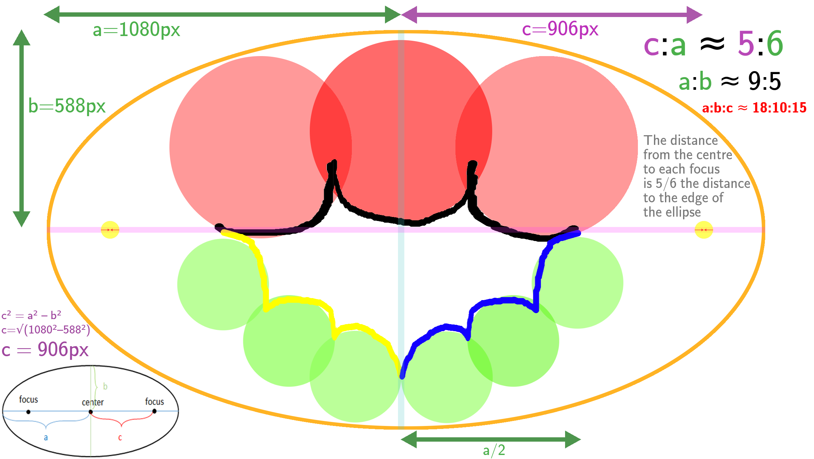
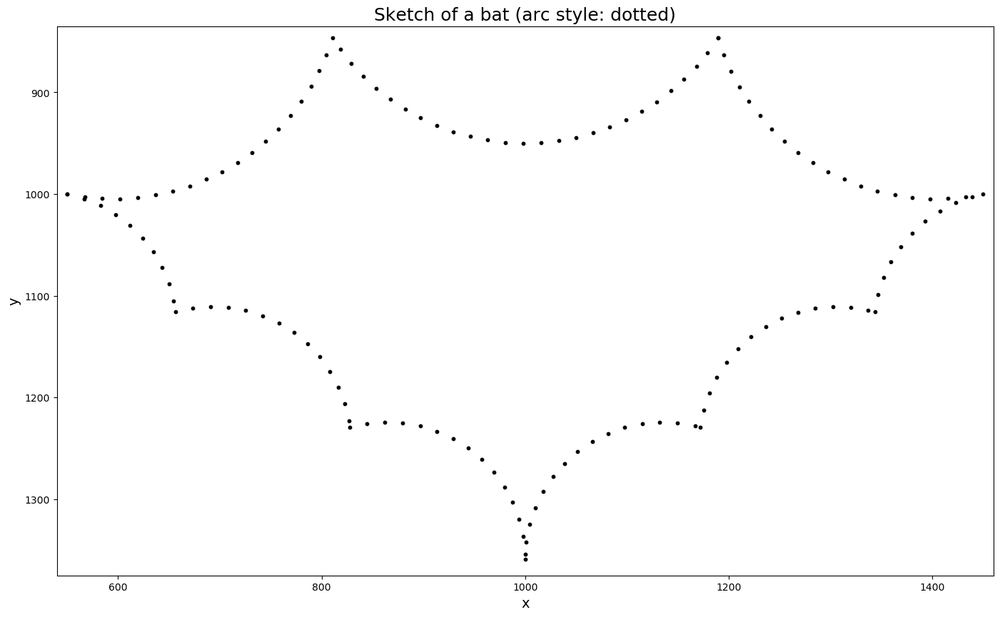

# 🦇 ᴇᴄʜᴏʟᴏᴄᴀᴛɪɴɢ … 🦇 ⋯ ᵉᶜʰᵒˡᵒᶜᵃᵗⁱⁿᵍ ⋯ 🦇

Sketching a bat with numpy and matplotlib, inspired by
"animated pencils" demonstrating hypocycloid and epicycloids.

(For images, see the _Results_ section of this README!)

Along the way, I figured out how to find the intersection of
a circle and an ellipse, and replaced a call to sympy's
`intersection` method with an algebraic calculation of
these points (rearranging the parametric simultaneous equation
for the circle and ellipse into a single quartic polynomial,
which can then be solved by numpy's `polyroot` by finding
the eigenvalues of the companion matrix).

A minimal working example of the intersection code, with
a unit circle and 2-by-1 ellipse is in `simple_ellipse.py`.

Code to check the quartic equations and print them with
simplification/factorising is in `equation_check.py`. I used
SymPy to verify the equations, and ultimately used SymPy-formatted
expressions to copy and paste in as code (i.e. substituting symbols
in the SymPy formulae for the Python variable names used).

For intersections of circles, no quartic polynomials needed to
be solved, only:
- some trigonometry (including 
  [arctan2](https://en.wikipedia.org/wiki/Atan2), which was new to me),
- graph theory (calculating the distance matrix between circle centre
  points to find an incidence matrix, i.e. a network with entries of 1
  indicating adjacent circles, with which to calculate a permutation
  that relabels circle centres in a sequential order "from 0 to 360°"
  such that the interior arcs can be drawn in a single connected curve),
- linear algebra (change of basis from the vector AB between two
  circle centre points under comparison for intersections, A and B,
  by constructing an orthonormal basis).

This project was extremely motivating to take my studies in maths
further, and in particular algebraic geometry. Some books I am currently
reading:

- Irving Kaplansky, _Linear Algebra and Geometry: A Second Course_
- Michael Henle, _A Combinatorial Introduction to Topology_

Books I also used while investigating this project:

- Horn & Johnson, _Matrix Analysis_ (see: companion matrix;
  Defn. 10.3.10; 3.3.P11)
- Byron & Fuller, _Mathematics of Classical and Quantum Physics_
  (for a refresher on bases A.K.A. coordinate systems in the first
  chapter)

## Further reading

### Intersection of conics

- StackOverflow Q&A which gave me the idea to rearrange into a quartic polynomial to solve the problem of circle-ellipse intersection: https://math.stackexchange.com/questions/3419984/find-the-intersection-of-a-circle-and-an-ellipse/3420063#3420063
- Mathematical formulae and JavaScript implementation of intersections for circles: https://www.xarg.org/2016/07/calculate-the-intersection-points-of-two-circles/

### Bezout's theorem

- (Wiki) Bezout's theorem: https://en.wikipedia.org/wiki/B%C3%A9zout%27s_theorem
- (Blog) A post on Bezout's theorem: https://thatsmaths.com/2014/01/30/bezouts-theorem/
- (PDF) An accessible explanation of Bezout's theorem: http://sections.maa.org/florida/proceedings/2001/fitchett.pdf

## Plan

**Fig. 1** — A rough sketch (made in a photo editor).

I began with just the intuition that the outline was formed by overlapping circles of 2 sizes, enclosed
within an ellipse, and that these could be parameterised by ellipse length ratios (after which I learnt
there are multiple '[eccentricity](https://en.wikipedia.org/wiki/Eccentricity_(mathematics)#Ellipses)'
measures for an ellipse) and a rough number of circles packed in, on which basis I made this sketch, and
then took estimates of proportions with which to parameterise their drawing in Matplotlib.

It turned out the focal length was not relevant, so the value of c was not important to record here.

## Results and notes on geometric construction

**Fig. 2** — A Matplotlib sketch with all 'workings out' shown.

The method of plotting can be seen from the markings:

1) Firstly, the top centre circle (`mtc`, pink) was drawn by setting its topmost circumference point at the point above
  the [outer] ellipse [the one drawn with a black dotted line]'s centre at (`xc`, `yc`) = (1000, 1000),
  indicated by the green arrow pointing directly upwards, then selecting its centre one Top Circle Radius
  distance (`tc_r`) below that point [i.e. from the tip of the green arrow back towards (`xc`, `yc`)]
  - See the comment `# (CIRCLE 1)` in the code of `sketch.py` for this, and similarly for other circles.
2) Secondly, the top left circle (`ltc`) was drawn by plotting the orange ellipse (the locus of points `tc_r` distance
  away from the outer ellipse circumference, i.e. the potential locations of circles inside it) and finding
  its intersection point with the lime green dotted circle of radius `tc_r` around the left midpoint (marked
  with a yellow arrow) of the horizontal line bisecting the outer ellipse. This intersection point is marked
  with a large red dot, around which the top left circle was drawn (in pink).
3) The top right circle (`rtc`) was plotted from the top left circle's centre mirrored about the line x = `xc`
4) The lower left-most circle (`llc`) was drawn "flat" to the top left circle (`ltc`), i.e. its centre
  was reached by going from the top left circle's centre (the red dot) to the left-most point where the top left circle
  crosses the horizontal line bisecting the ellipse, and then continuing in this same direction for another Lower
  Circle Radius distance (`lc_r`).
  - Since it is 'flat' in this way, there is only one point of intersection, there is the desired sharp exterior angle at
    which the curves meet (which becomes the interior of the outline of the bat). The flatness of this exterior arc junction
    becomes the sharpness of the arc outline's interior – a pointy bat!
5) The bottom-most, horizontal-midpoint-touching circle was found by rearranging the Cartesian equation for the
  outer ellipse for y, so as to find the point a little to the left of the ellipse's bottom circumference midpoint (this
  midpoint, `oem`, is marked with a red dot and the point a little to the left is marked with a blue dot), which had a
  known x value (`xc`, the x coordinate of the ellipse centre point, minus the radius of the circle).
6) The final lower left quadrant's circle (`flmc`) was then placed at the midpoint of the other two circle centres
  (`llc` and `bmlc`).
7), 8), 9) were mirrored across the line x = `xc` from the circle centres plotted in the bottom left quadrant of the
  ellipse, to the lower right quadrant of the circle. As such, their variables have the prefixes: `r_bmlc`, `r_flmc`, `r_llc`.

This sketch is reproducible by running `sketch.py` with `SUPPRESS_SKETCH_VIS` set to `False`.

---

**Fig. 3** — A Matplotlib sketch with no 'workings out' shown (`SUPPRESS_SKETCH_VIS` set to `True`), which crops the axis to
show only the bat's arc outline, styled with a dotted line (`ARC_STYLE` = `dotted`).

- Uniform spacing is achieved by normalising
the angle between plotted points (the `arange` function in NumPy constructs a linear sequence from 0 to 2π radians (i.e. 0-360°)
giving a fixed spacing in terms of the 'angle step': if this spacing is calculated by dividing by the radius of the circle,
then it normalises the spacing between circles of varying radii, which would otherwise spread the same range over varying lengths:
2πr per 2π radians).

---

**Fig. 4** — A Matplotlib sketch with no 'workings out' shown, and arc style set to "thin".

Unlike "dotted" and "thick" arc styles, this outline is drawn with a single line rather than circle markers (and is therefore fastest to plot).

---

**Fig. 5** — A Matplotlib sketch with no 'workings out' shown, and arc style set to "thick".

Like the "dotted" arc style, this is drawn with `plt.scatter` using circle markers, however deliberately large and tightly spaced so as to
appear like one thick line. Attempts to draw a thick line with `plt.plot` give misaligned ends, which doesn't look very satisfying.
