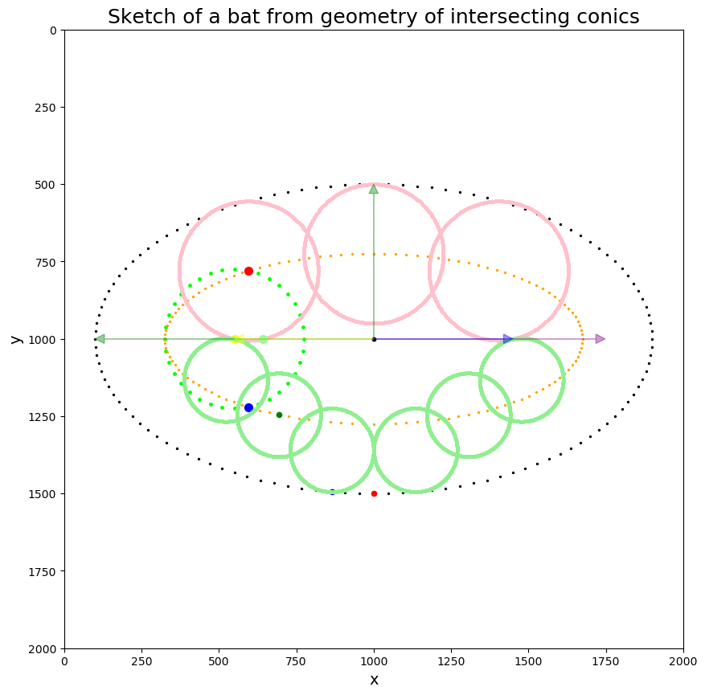
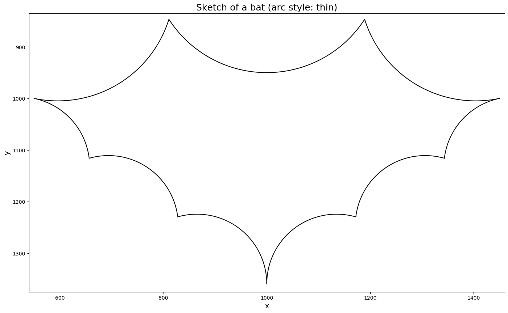
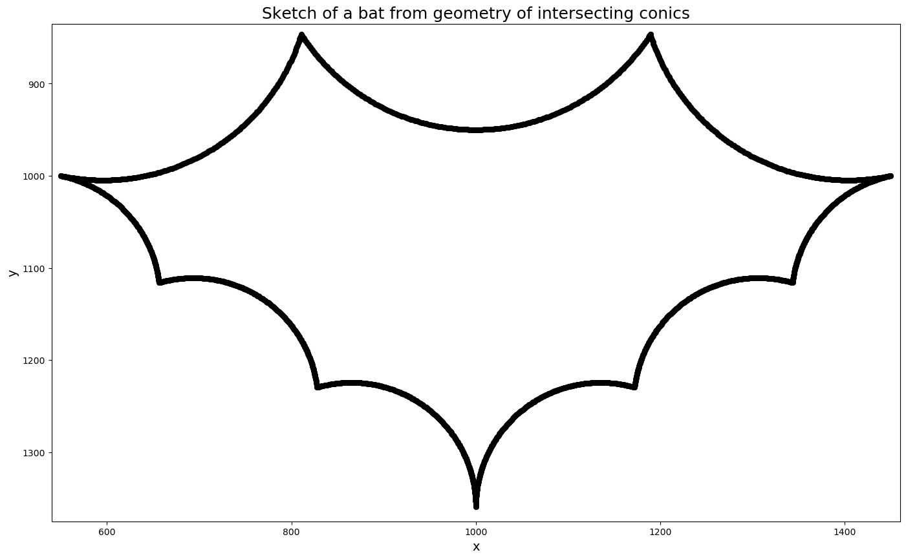

# 🦇 ᴇᴄʜᴏʟᴏᴄᴀᴛɪɴɢ … 🦇 ⋯ ᵉᶜʰᵒˡᵒᶜᵃᵗⁱⁿᵍ ⋯ 🦇

Sketching a bat with numpy and matplotlib, inspired by
"animated pencils" demonstrating hypocycloid and epicycloids.

Along the way, I figured out how to find the intersection of
a circle and an ellipse, and replaced a call to sympy's
`intersection` method with an algebraic calculation of
these points (rearranging the parametric simultaneous equation
for the circle and ellipse into a single quartic polynomial,
which can then be solved by numpy's `polyroot` by finding
the eigenvalues of the companion matrix).

A minimal working example of the intersection code, with
a unit circle and 2-by-1 ellipse is in `simple_ellipse.py`.

Code to check the quartic equations and print them with
simplification/factorising is in `equation_check.py`.

Complete!

