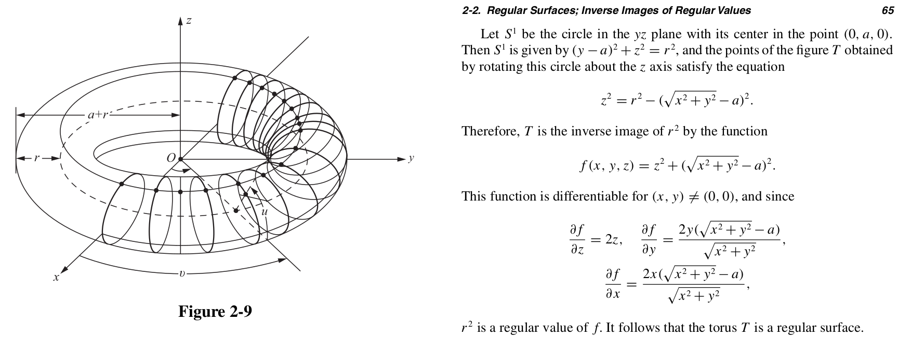

# 🦇 ᴇᴄʜᴏʟᴏᴄᴀᴛɪɴɢ … 🦇 ⋯ ᵉᶜʰᵒˡᵒᶜᵃᵗⁱⁿᵍ ⋯ 🦇

Sketching a bat with numpy and matplotlib, inspired by
"animated pencils" demonstrating hypocycloid and epicycloids.

(To skip to the images and explanation of the geometric construction,
jump to the [_Results_](#results-and-notes-on-geometric-construction) section)

Along the way, I figured out how to find the intersection of
a circle and an ellipse, and replaced a call to sympy's
`intersection` method with an algebraic calculation of
these points (rearranging the parametric simultaneous equation
for the circle and ellipse into a single quartic polynomial,
which can then be solved by numpy's `polyroot` by finding
the eigenvalues of the companion matrix).

A minimal working example of the intersection code, with
a unit circle and 2-by-1 ellipse is in [`simple_ellipse.py`](https://github.com/lmmx/bat/blob/master/src/simple_ellipse.py).

Code to check the quartic equations and print them with
simplification/factorising is in [`equation_check.py`](https://github.com/lmmx/bat/blob/master/src/equatin_check.py). I used
SymPy to verify the equations, and ultimately used SymPy-formatted
expressions to copy and paste in as code (i.e. substituting symbols
in the SymPy formulae for the Python variable names used).

For intersections of circles, no quartic polynomials needed to
be solved, only:
- some trigonometry (including 
  [arctan2](https://en.wikipedia.org/wiki/Atan2), which was new to me),
- graph theory (calculating the distance matrix between circle centre
  points to find an incidence matrix, i.e. a network with entries of 1
  indicating adjacent circles, with which to calculate a permutation
  that relabels circle centres in a sequential order "from 0 to 360°"
  such that the interior arcs can be drawn in a single connected curve),
- linear algebra (change of basis from the vector AB between two
  circle centre points under comparison for intersections, A and B,
  by constructing an orthonormal basis).

This project was surprisingly motivating to rekindle my studies in
algebraic geometry (since conics such as circles and ellipses are the
classic introductory examples of algebraic varieties). The foremost
reference on this topic is _Ideals, Varieties, and Algorithms_ by
Cox, Little, and O'Shea (conics are discussed on page 6 and intersection
of conics on pages 451-467, however the focus there is on finding the number
of intersections [quantifying the "multiplicity"] more than locating
the points of intersection).

Some books I am currently reading:

- Irving Kaplansky, _Linear Algebra and Geometry: A Second Course_
- Michael Henle, _A Combinatorial Introduction to Topology_

Books I also used while investigating this project:

- Horn & Johnson, _Matrix Analysis_ (see: companion matrix;
  Defn. 10.3.10; 3.3.P11)
- Byron & Fuller, _Mathematics of Classical and Quantum Physics_
  (for a refresher on bases A.K.A. coordinate systems in the first
  chapter)

### Now what?

Some other ideas I'd like to investigate having completed what I set out to do:
- Figure out if the arcs can now be parameterised as a single curve somehow
  - DFT can be used to convert line drawing images [as coordinates] to parametric equations (example: ["How To Draw Einstein's Face Parametrically"](http://www.i-programmer.info/projects/119-graphics-and-games/5735-how-to-draw-einsteins-face-parametrically.html), [code](https://www.i-programmer.info/CodeBin/Parametric.zip))
  - 1st order animation possible to get coordinate change --> calculate resulting parametric equation change?
    (e.g. ["First Order Motion Model for Image Animation"](https://github.com/AliaksandrSiarohin/first-order-model) at NeurIPS 2019, [via](https://twitter.com/healthyalgo/status/1312818343582199808?s=21))
- Experiment with ellipses instead of circles to get 'sharper' curve ends, etc.
  - or even conics inscribed inside other conics
  - Animate the bat by altering these parameters to produce 'flapping'
- Turn the 2D shape into a 3D model, by importing into Blender and/or numpy-stl,
  and applying something along the lines of a cross between 'ravioli',
  `z = sin(x)sin(y)` – described in Callahan's _Advanced Calculus: A Geometric View_
  (p.380) – and a symmetry map (as explored in my [symmap](https://github.com/lmmx/symmap)
  repo earlier this year.)
  - Note that GitHub renders `.stl` files nicely (e.g. see this model of a
    satellite in my [3dv](https://github.com/lmmx/3dv/blob/master/stl/Deep_Space_1.stl)
    repo)
- Animate the bat in 3D by constructing a torus rather than an ellipse, and moving
  it around the torus.
  - Construction of a torus is detailed in _Differential Geometry of Curves and Surfaces_
  by Do Carmo:
    - illustrated in figure 2-9 alongside 2.2 example 4 on p.64:
      - 
    - parameterisation in example 6 on p.67):
      - `x(u,v) = ((r*cos(u) + a)*cos(v), (r*cos(u) + a)*sin(v), r*sin(u)`

## Further reading

### Inspirations for this work

- (Blog) This visual explanation of hypocycloids (which I'd come across before) kick started this project
  from idle thought into code: https://bhaskar-kamble.github.io/wheelswithinwheels.html
- (Wiki) Hypotrochoid: https://en.wikipedia.org/wiki/Hypotrochoid
- (Code) Python program for drawing hypocycloids: https://github.com/righthandabacus/hypcycloid/blob/master/hypcycloid.py

### Intersection of conics

- (Q&A) StackOverflow gave me the idea to rearrange into a quartic polynomial to solve the problem of circle-ellipse
  intersection: https://math.stackexchange.com/questions/3419984/find-the-intersection-of-a-circle-and-an-ellipse/3420063#3420063
- (Blog) Mathematical formulae and JavaScript implementation of intersections for circles:
  https://www.xarg.org/2016/07/calculate-the-intersection-points-of-two-circles/

### Bezout's theorem and intersection theory in algebraic geometry

- (Wiki) Bezout's theorem: https://en.wikipedia.org/wiki/B%C3%A9zout%27s_theorem
- (Blog) A post on Bezout's theorem: https://thatsmaths.com/2014/01/30/bezouts-theorem/
- (PDF) An accessible explanation of Bezout's theorem: http://sections.maa.org/florida/proceedings/2001/fitchett.pdf

More advanced references than relevant to this project, but which I found of interest:

- (PDF) _"Intersection Theory in Algebraic Geometry: Counting Lines in Three Dimensional Space"_
  by Jeremy Booher: https://www.math.arizona.edu/~jeremybooher/expos/intersection_theory_promys.pdf
- (PDF) _"Enumerative Algebraic Geometry of Conics"_ by Bashelor et al.:
  https://www.maa.org/sites/default/files/images/upload_library/22/Ford/Bashelor.pdf
  - This paper won the authors the 2009 Merten M. Hasse prize from the Mathematical Association of America:
    https://www.maa.org/programs/maa-awards/writing-awards/enumerative-algebraic-geometry-of-conics
  - A discussion of the approach to whittling down the possible number of intersections they talk about (from
    7776 to 3264) can also be found in _Defining Algebraic Intersections_ by Fulton and MacPherson,
    chapter 1 of the book _Algebraic Geometry_ edited by Loren D. Olson (Springer, 1978).

## Plan

**Fig. 1** — A rough sketch (made in a photo editor).

I began with just the intuition that the outline was formed by overlapping circles of 2 sizes, enclosed
within an ellipse, and that these could be parameterised by ellipse length ratios (after which I learnt
there are multiple '[eccentricity](https://en.wikipedia.org/wiki/Eccentricity_(mathematics)#Ellipses)'
measures for an ellipse) and a rough number of circles packed in, on which basis I made this sketch, and
then took estimates of proportions with which to parameterise their drawing in Matplotlib.

It turned out the focal length was not relevant, so the value of c was not important to record here.

## Results and notes on geometric construction

**Fig. 2** — A Matplotlib sketch with all 'workings out' shown.

The method of plotting can be seen from the markings:

1) Firstly, the top centre circle (`mtc`, pink) was drawn by setting its topmost circumference point at the point above
  the [outer] ellipse [the one drawn with a black dotted line]'s centre at (`xc`, `yc`) = (1000, 1000),
  indicated by the green arrow pointing directly upwards, then selecting its centre one Top Circle Radius
  distance (`tc_r`) below that point [i.e. from the tip of the green arrow back towards (`xc`, `yc`)]
  - See the comment `# (CIRCLE 1)` in the code of [`sketch.py`](https://github.com/lmmx/bat/blob/master/src/sketch.py)
    for this, and similarly for other circles.
  - Note that the y axis is 'inverted', as advocated by B. J. Korites in _Python Graphics: A Reference…_ (see p.29)
2) Secondly, the top left circle (`ltc`) was drawn by plotting the orange ellipse (the locus of points `tc_r` distance
  away from the outer ellipse circumference, i.e. the potential locations of circles inside it) and finding
  its intersection point with the lime green dotted circle of radius `tc_r` around the left midpoint (marked
  with a yellow arrow) of the horizontal line bisecting the outer ellipse. This intersection point is marked
  with a large red dot, around which the top left circle was drawn (in pink).
3) The top right circle (`rtc`) was plotted from the top left circle's centre mirrored about the line x = `xc`
4) The lower left-most circle (`llc`) was drawn "flat" to the top left circle (`ltc`), i.e. its centre
  was reached by going from the top left circle's centre (the red dot) to the left-most point where the top left circle
  crosses the horizontal line bisecting the ellipse, and then continuing in this same direction for another Lower
  Circle Radius distance (`lc_r`).
  - Since it is 'flat' in this way, there is only one point of intersection, there is the desired sharp exterior angle at
    which the curves meet (which becomes the interior of the outline of the bat). The flatness of this exterior arc junction
    becomes the sharpness of the arc outline's interior – a pointy bat!
5) The bottom-most, horizontal-midpoint-touching circle was found by rearranging the Cartesian equation for the
  outer ellipse for y, so as to find the point a little to the left of the ellipse's bottom circumference midpoint (this
  midpoint, `oem`, is marked with a red dot and the point a little to the left is marked with a blue dot), which had a
  known x value (`xc`, the x coordinate of the ellipse centre point, minus the radius of the circle).
6) The final lower left quadrant's circle (`flmc`) was then placed at the midpoint of the other two circle centres
  (`llc` and `bmlc`).
7), 8), 9) were mirrored across the line x = `xc` from the circle centres plotted in the bottom left quadrant of the
  ellipse, to the lower right quadrant of the circle. As such, their variables have the prefixes: `r_bmlc`, `r_flmc`, `r_llc`.

This sketch is reproducible by running [`sketch.py`](https://github.com/lmmx/bat/blob/master/src/sketch.py) with `SUPPRESS_SKETCH_VIS` set to `False`.

---

**Fig. 3** — A Matplotlib sketch with no 'workings out' shown (`SUPPRESS_SKETCH_VIS` set to `True`), which crops the axis to
show only the bat's arc outline, styled with a dotted line (`ARC_STYLE` = `dotted`).

- Uniform spacing is achieved by normalising
the angle between plotted points (the `arange` function in NumPy constructs a linear sequence from 0 to 2π radians (i.e. 0-360°)
giving a fixed spacing in terms of the 'angle step': if this spacing is calculated by dividing by the radius of the circle,
then it normalises the spacing between circles of varying radii, which would otherwise spread the same range over varying lengths:
2πr per 2π radians).

---

**Fig. 4** — A Matplotlib sketch with no 'workings out' shown, and arc style set to "thin".

Unlike "dotted" and "thick" arc styles, this outline is drawn with a single line rather than circle markers (and is therefore fastest to plot).

---

**Fig. 5** — A Matplotlib sketch with no 'workings out' shown, and arc style set to "thick".

Like the "dotted" arc style, this is drawn with `plt.scatter` using circle markers, however deliberately large and tightly spaced so as to
appear like one thick line. Attempts to draw a thick line with `plt.plot` give misaligned ends, which doesn't look very satisfying.

## Some other sketches along the way

Rather than deleting the intermediate sketches, I'm including them here as they might be useful for anyone curious about some of these
geometric functions. Find the sketches and links to the code to make them below:

**Fig. 6** — A quick demo of the arctan2 function, for four points on the circumference of a circle radius `sqrt(8)`.
The four points are first plotted (larger coloured circles at low opacity), then 'recovered' from their (x,y) coordinates by
arctan2, the success of which is confirmed by plotting them again from the calculated angle away from the circle centre
(shown as the smaller, higher opacity dots on top of the other ones).
Generated by [`arctan2_test_sketch.py`](https://github.com/lmmx/bat/blob/master/src/arctan2_test_sketch.py).

The arctan2 (or atan2) function takes a `(y,x)` tuple (in that order, by convention) and returns the angle
of the point (x,y) with respect to some centre. It seems to be mainly used in games programming, and was first
implemented in FORTRAN at IBM apparently. Note that despite the notation, the `y` and `x` value are relative to the centre
(it would probably be better to call them `dy` and `dx`).
- See the `numpy.arctan2` documentation [here](https://docs.scipy.org/doc/numpy/reference/generated/numpy.arctan2.html).
- See the Wikipedia page on arctan2 [here](https://en.wikipedia.org/wiki/Atan2).

---

**Fig. 7** — A 'minimal working example' of the circle exterior arc plotting, with alternating colours for arcs of different circles.
Generated by [`interior_trace_sketch.py`](https://github.com/lmmx/bat/blob/master/src/interior_trace_sketch.py).

I made this sketch to check the code logic for plotting arcs along the interior, which was along the lines of
"go through the sequence of circle centres which has been reordered so that they proceed clockwise from 0 to 2π"
